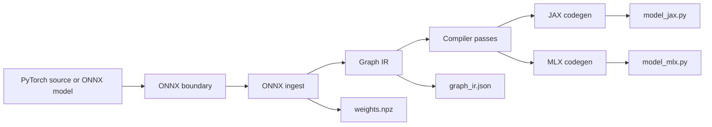

# Architecture

## Why the Project Starts at ONNX

`tnnx` chooses the graph boundary on purpose.

Once a model is exported to ONNX, the compiler can:

- inspect the operator surface explicitly
- extract initializers deterministically
- normalize model semantics into one IR
- run passes independent of framework-specific Python code
- emit artifacts for multiple backends from the same graph

That turns backend support into a lowering problem instead of a rewrite problem.

## High-Level Pipeline

## Main Components

### ONNX ingest

Responsibilities:

- load the model and optional shape information
- fold constants and extract initializers
- map ONNX operators into a semantic operator vocabulary
- build the internal graph representation

### Graph IR

The IR is intentionally boring and explicit.

It tracks:

- tensors
- nodes
- attrs
- graph inputs and outputs
- deterministic serialization

That simplicity matters because it keeps the backends understandable and makes
the artifacts diffable.

### Compiler passes

Current passes are conservative:

- prune
- normalize
- shape propagation

This is the right baseline for a compiler that still needs to prove semantics
before it starts becoming aggressive.

### Backend emission

Current target styles:

- `jax`: generated Python runtime module
- `mlx`: generated Python runtime module

The important design choice is that backends target the internal IR, not ONNX
directly.

## Artifacts Worth Showing in a Demo

- `graph_ir.json`: proves there is a real compiler middle-end
- `model_jax.py` or `model_mlx.py`: proves readable backend code generation
- `weights.npz`: proves the compile/runtime artifact split

## Design Principles

- correctness before optimization
- deterministic artifacts
- backend-specific lowering over generic magic
- explicit contracts for generated runtimes
- honest support claims backed by example lanes
